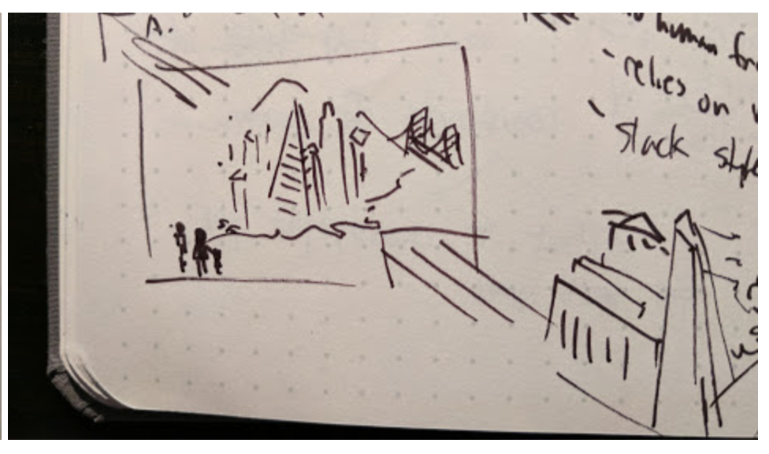

## video styles

i've got mostly 3 ideas / styles i see as being possible (examples culled from outstanding work on the web):

#### isometric w/ tiny people
I. my favorite one uses isometry (a form of 3d drawing where there's no vanishing point) and tiny human characters to both show how overwhelming life can be (we're but small and helpless) and allow more visual space for diagram-like compositions (no unnecessary focus on human features, which are difficult to animate and make endearing). there's plenty of potential for visual comedy with scale of this sort too. the best example of this kind of animation is [Persistent Peril's Barbican history animation (click for link)](https://vimeo.com/73963759) or [Aperture Science's hilarious series of game promotions](https://www.youtube.com/watch?v=BDj1fYlwR00). here's some sketches that show how I kind of see a PHIX animation in this style playing out:

here's our heroine, moving from city to city - this shows the cities kind of moving in front of them in miniature, like on a conveyor belt. each city stops for a second before moving on, kinda telling the story of her traveling all over (she changes clothes / adds family suddenly with each stop, haha). the representations of the cities probably wont be very accurate or even focus on landmarks (they might not even be named?), since that adds time and isn't relevant.

heres an abstract / absurd cluster of hospital, pharmacy, dentist, and optometrist (anything else to add?), which she runs frantically to and from. the husband is himself going to other destinations in the same area at the same time. at each location, as she enters, a sound plays (drill sound when she goes into the dentist), and then as she emerges from the door, a little data-uploading animation goes over the top of the business (you can see the little cloud with [reverse] rain over the hospital). thing is, every data-uploading thing is different - colors, shape, whether it's even a cloud or not. they all store different formats in different places! 

i don't know where this fits in a chronology but here's a scene in which she enters a building and we see a small cutaway of her sitting on the bench while doc looks at his computer / her papers and insists she get more records just for him (since he doesn't want to sift through her old stuff). there's a little 'magnifying view' of his scrunched up face as he looks at her papers (sorry, it doesn't look like that at all).

and towards the end, we can use a scene like this, wherein she's hustling in a dark room by herself, and all the different contexts of health apps, portals, services, etc. are literally tumbling down into a heap on top of her (mind) and showing the chaos of contemporary health recordkeeping.  

this style saves a lot of time on character things (i think!), which are a huge time drain, but it's also way more ambitious because it's dramatic (and the best way i could think of/can do to tell our story), and i admit i don't have a ton of experience making rich visual compositions in 3d. i think it'll take somewhere from 30 to 60 hours of raw work, not including whiteboard time with you to get the storyboard right and make adjustments (that time doesn't have to count, depending). 

#### 2d vector
i don't actually have sketches for this or the other idea, but the difference is mostly stylistic. we could also do a more traditional 2d vector animation - it's a popular style today and most of my recent animation work is like this (think the phone app onboarding animation i did, or even the [although it's isometric] alarm clock video). the best/most popular in the business I can think of at this style are probably [Kurzgesagt (click for link)](https://www.youtube.com/watch?v=f7KSfjv4Oq0) and [James Curran (click for link)](https://www.youtube.com/watch?v=LzPuEUETRC8). 

it's a little more bland visually, in my opinion - look at the big, unshaded swaths of filled color on a character's body - and a lot of folks are doing this sort of thing nowadays. there are lots less visual / design questions when you're working with flat ground and foregrounded characters, though (and you can trust i'll always try to be inventive even if i'm working in a cliche style). depending on how much the characters move, i think we're looking at 30-48 hours for something like this.

#### abstract and really diagrammy
if you're not afraid to lose or mostly omit the human factor, we could also do a purely diagrammatic / abstract animation. [Slack (their oldest/first video, link)](https://vimeo.com/143282979) and [Asana (link)](https://vimeo.com/142414607) are two companies who've used this approach for their videos (same studio, actually...) and it looks nice. There are more opportunities for visual comedy (stuff bouncing around) and creativity (shapes and assemblages transitioning and becoming other stuff etc.) than you might think, but I don't think this stuff can hold attention for too long (then again, the other styles will take exponentially longer to make the longer the runtime is...). if you're time conscious about your audience's attention span in general, one benefit of this style I could see is that it can segue effortlessly or even just kinda be intertwined with showing the design of the actual application. every style is pretty dependent on narration, but in this particular case we're completely dependent on narration to make things coherent and keep the audience engaged.
my bet is this takes around 16-36 hours...if we add quirks that make it charming, like physics, they make production time hard to estimate. 

## prototype options 
so no matter what we go with here, i think the screens/mockups/prototype we produce features 3 main areas - adding (integrating from many different sources with ease), viewing (having easy access with additional insights to any info), and sharing (cooperative care of child/elder, or sending records to a doctor). my estimates for time are based on walking through those each of those 3 areas with 1-3 workflows. 

#### bare minimum / invision mockup or slides
there's little opportunity for the animation or polish that makes an app feel like an app, but invision gives us a low barrier to phone use (though you might have to just hand one device around?) and this type of deliverable lets us iterate more quickly on the actual design and save work for when the product is real. this could be done in 8-20 hours. 

#### pretend video of somebody using it
we won't have to be designing lots of 'pathways' like we might need to with interactive versions - this'll be seamless. but it's not participatory, and i don't know if investors will be leery without being able to see interactive product. this does give us a chance to make the UX look very polished, but i don't know if a longer video will bore the audience. i think we can do it in 16-30 hours. 

#### mobile website
i don't think my time / your money will be well spent on me making a native app - but we can quickly put together a site that'll run when users go to a URL that features a few pathways (and a lot of 'sorry, under construction' buttons or something equivalent). this actually probably gives me more flexibility to do animations and 'nice UX things' than the invision approach, and is the most participatory, but it will probably take the longest. it probably won't be airtight (users scrolling up will see the browser's back button, which they wouldn't in a real app) and might not work on everyone's phone (diff versions of android have diff browser quirks, iOS safari is awful...) either. this'd take anywhere from 24-60 hours.

## final note
like i said before, i hope to be getting somewhere around $60/hr. professional design agencies tend to overestimate hours so they don't get short shrift - i tried not to do that, but the flip side is i'm not super confident in any of my estimations - they're probably more informative relating to one another than the are as absolute measures of time. the examples of others' work are award-winning pieces from entire studios of professional animators, so please don't hold me to that standard, either (promise i'll aid your communication creatively, though). i like your project, so naturally we can negotiate on $, and the more exciting the design / more relaxed the timeline, the easier it'll be to accommodate. meetings for feedback and ideation don't have to count (fully ;)) as hours either since collaboration is what makes doing stuff worthwhile, and it's best if everything is designed to work naturally with your talk. also don't forget other costs may become involved - minimally we'd have to buy sounds, but we might even need to find a narrator (i do know a guy with a great voice, though...). we can probably grab ambient music for cheap.
